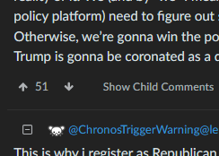

# firefox-extensions
Some Firefox extensions I made to make my internet experience better.

Not for general public use, but if you found this repo and want a Firefox extension made or expanded upon,
let me know.

## Programming.dev Lemmy Extensions
### Building
Run `npx webpack` in the root directory of this extension.

### Hide/Show Child Comments

### Keyboard Navigation
Rudimentary keyboard navigation is enabled in comments by default.
 - j - Next Comment
 - k - Previous Comment
 - m - Show/Hide Child Comments

### Extension Options
Options for the extension can be found by clicking the menu button and going to `Add-ons and themes` or by hitting `CTRL+Shift+A` in Windows.    

Once there, find and click `Programming.Dev Lemmy Helper`, then click `Options`.

Current options are as follows:
| Option | Description | Default |
|----------|------------|-----------|
| Default Child Comment Visibility | Sets whether or not Child Comments are hidden by default. | Show Child Comments
| Enable Keyboard Navigation | Enables/Disables Keyboard Navigation | Enabled